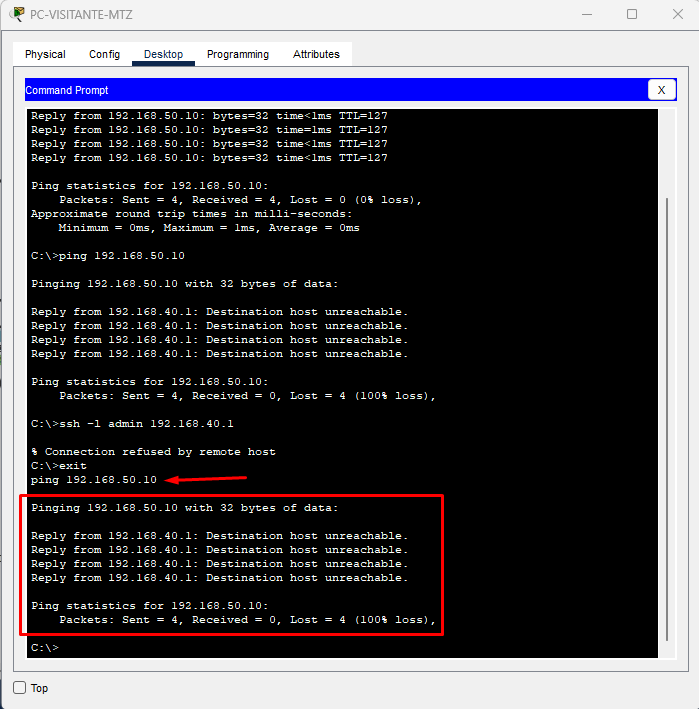
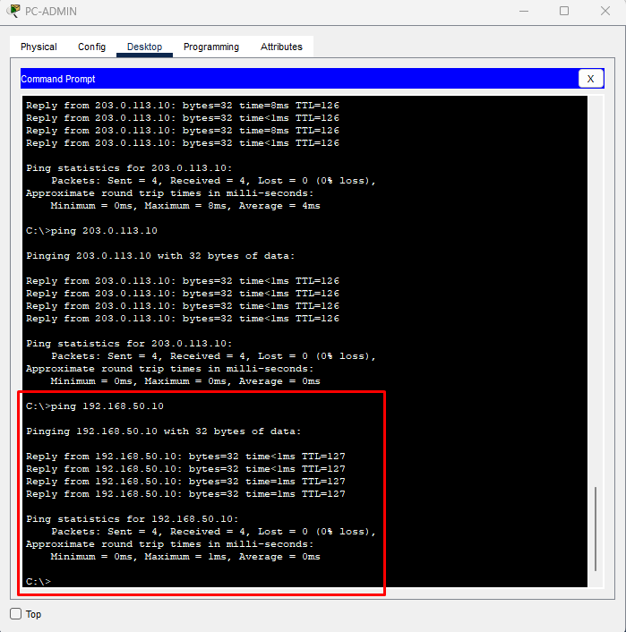

# Rede Corporativa Segura no Cisco Packet Tracer

Projeto de simulação de uma rede corporativa desenvolvido no **Cisco Packet Tracer**, com foco em segmentação de rede, roteamento, controle de acesso, serviços internos e boas práticas de infraestrutura.

A proposta é representar um ambiente empresarial com **matriz no Rio de Janeiro** e **filial em Maricá**, aplicando conceitos usados em redes reais, como VLANs, DHCP, roteamento entre redes, ACLs, NAT/PAT, SSH e segurança em portas de switch.

---

## Visão Geral

Este projeto simula a infraestrutura de rede de uma empresa com dois ambientes principais:

- Matriz localizada no Rio de Janeiro
- Filial localizada em Maricá
- Servidor interno para DNS e Web
- Internet simulada através de um roteador ISP
- Servidor externo simulando um site na internet

A rede foi organizada por setores, separando os dispositivos em VLANs diferentes para melhorar a administração, o desempenho e a segurança do ambiente.

---

## Topologia da Rede


---

## Objetivos do Projeto

- Criar uma topologia corporativa funcional no Cisco Packet Tracer
- Segmentar a rede por setores utilizando VLANs
- Configurar comunicação entre matriz e filial
- Implementar roteamento entre VLANs
- Automatizar a entrega de endereços IP com DHCP
- Aplicar regras de segurança com ACLs
- Configurar acesso remoto seguro via SSH
- Restringir o acesso administrativo apenas ao setor de TI
- Simular serviços internos como DNS e servidor Web
- Simular acesso externo utilizando NAT/PAT
- Aplicar segurança básica em portas de switch com Port Security
- Documentar o projeto de forma clara para estudo e portfólio

---

## Tecnologias e Conceitos Utilizados

- Cisco Packet Tracer
- VLANs
- Trunk 802.1Q
- Router-on-a-Stick
- Roteamento entre VLANs
- Rotas estáticas
- DHCP
- DNS
- Servidor Web
- ACLs
- SSH
- Port Security
- NAT/PAT
- Endereçamento IPv4
- Testes de conectividade
- Documentação técnica de rede

---

## Estrutura Lógica da Rede

| VLAN | Setor | Rede |
|---|---|---|
| 10 | Administração | 192.168.10.0/24 |
| 20 | TI | 192.168.20.0/24 |
| 30 | Financeiro | 192.168.30.0/24 |
| 40 | Visitantes - Matriz | 192.168.40.0/24 |
| 50 | Servidores | 192.168.50.0/24 |
| 60 | Atendimento - Filial | 192.168.60.0/24 |
| 70 | Operacional - Filial | 192.168.70.0/24 |
| 80 | Visitantes - Filial | 192.168.80.0/24 |

---

## Dispositivos Utilizados

| Dispositivo | Função |
|---|---|
| R-MATRIZ | Roteador principal da matriz |
| R-FILIAL | Roteador principal da filial |
| ISP | Roteador simulando a operadora/internet |
| SW-MATRIZ | Switch de acesso da matriz |
| SW-FILIAL | Switch de acesso da filial |
| SRV-DNS-WEB | Servidor interno de DNS e Web |
| SRV-INTERNET | Servidor externo simulando um site na internet |
| PCs da Matriz | Hosts dos setores da matriz |
| PCs da Filial | Hosts dos setores da filial |

---

## Segmentação por VLAN

A rede foi dividida por setores utilizando VLANs. Essa separação melhora a organização, reduz tráfego desnecessário de broadcast e facilita a aplicação de regras de segurança.

### VLANs da Matriz


### VLANs da Filial


---

## DHCP

O DHCP foi configurado nos roteadores para entregar endereços IP automaticamente aos hosts de cada VLAN.

Os servidores utilizam IP fixo, enquanto os computadores recebem IP automaticamente conforme a VLAN em que estão conectados.

### DHCP na Matriz


### DHCP na Filial


---

## Servidor DNS e Web Interno

O servidor interno foi configurado com IP fixo na rede de servidores:

```text
IP: 192.168.50.10
Gateway: 192.168.50.1
DNS: 192.168.50.10
```

Foi criado o domínio interno:

```text
empresa.local
```

Esse nome aponta para o servidor interno, permitindo o acesso ao serviço Web sem precisar digitar diretamente o endereço IP.


---

## Controle de Acesso com ACL

Foram configuradas ACLs para impedir que redes de visitantes acessem a rede de servidores internos.

Regras aplicadas:

```text
Visitantes da matriz não acessam o servidor interno.
Visitantes da filial não acessam o servidor interno.
Usuários autorizados continuam acessando normalmente.
```

### Visitante Bloqueado



### Administração com Acesso Permitido



---

## Acesso Remoto Seguro com SSH

O acesso remoto aos roteadores foi configurado utilizando SSH, substituindo o uso de Telnet.

Também foi aplicada uma regra para permitir acesso administrativo somente a partir da rede de TI:

```text
VLAN 20 - TI
Rede: 192.168.20.0/24
```

### SSH Permitido para o Setor de TI


### SSH Bloqueado para Visitantes


---

## NAT/PAT e Internet Simulada

Foi criada uma internet simulada utilizando um roteador ISP e um servidor externo.

O servidor externo utiliza o endereço:

```text
203.0.113.10
```

O roteador da matriz realiza NAT/PAT, permitindo que redes internas privadas acessem a internet simulada utilizando o endereço externo da interface conectada ao ISP.

### Acesso ao Servidor Externo


### Tradução NAT/PAT


A tradução mostra que um IP interno, como:

```text
192.168.10.21
```

sai para a internet simulada utilizando o IP externo:

```text
200.0.0.2
```

---

## Regras de Segurança Aplicadas

- Visitantes não acessam servidores internos
- Acesso SSH permitido somente para a rede de TI
- Servidores utilizam endereço IP fixo
- Usuários recebem IP via DHCP
- Portas de acesso dos switches utilizam Port Security
- Comunicação entre matriz e filial é feita por roteamento
- Acesso externo é realizado com NAT/PAT
- Telnet não foi utilizado, priorizando acesso remoto via SSH

---

## Testes Realizados

| Teste | Resultado |
|---|---|
| PC-ADMIN recebeu IP via DHCP | Sucesso |
| PC-VISITANTE-FILIAL recebeu IP via DHCP | Sucesso |
| PC-ADMIN acessou servidor interno | Sucesso |
| Visitante da matriz tentou acessar servidor | Bloqueado |
| PC-TI acessou roteador via SSH | Sucesso |
| Visitante tentou acessar SSH | Bloqueado |
| PC-ADMIN acessou servidor externo | Sucesso |
| NAT/PAT traduziu IP interno para IP externo | Sucesso |

---

## Estrutura do Projeto

```text
enterprise-network-packet-tracer
│
├── README.md
├── LICENSE
│
└── enterprise-network-packet-tracer
    ├── enterprise-network.pkt
    │
    └── imagens
        ├── 01-topologia-completa.png
        ├── 02-vlans-matriz.png
        ├── 03-vlans-filial.png
        ├── 04-dhcp-pc-admin.png
        ├── 05-dhcp-pc-visitante-filial.png
        ├── 06-dns-web-empresa-local.png
        ├── 07-acl-visitante-matriz-bloqueado.png
        ├── 08-admin-acessa-servidor.png
        ├── 09-ssh-ti-acesso-permitido.png
        ├── 10-ssh-visitante-bloqueado.png
        ├── 11-internet-simulada.png
        └── 12-nat-translations.png
```

---

## Como Abrir o Projeto

1. Baixe o arquivo `.pkt`
2. Abra no Cisco Packet Tracer
3. Verifique a topologia
4. Execute os testes de conectividade
5. Analise as configurações dos roteadores, switches e servidores

Arquivo do projeto:

```text
enterprise-network-packet-tracer/enterprise-network.pkt
```

---

## Conclusão

Este projeto demonstra a criação de uma rede corporativa segmentada, segura e funcional, simulando um ambiente empresarial com matriz e filial.

Foram aplicados conceitos fundamentais de redes, como VLANs, roteamento, DHCP, DNS, ACLs, SSH, Port Security e NAT/PAT.

O projeto serve como prática técnica e também como material de portfólio para demonstrar conhecimentos em infraestrutura de redes, segurança básica e administração de ambientes corporativos.
